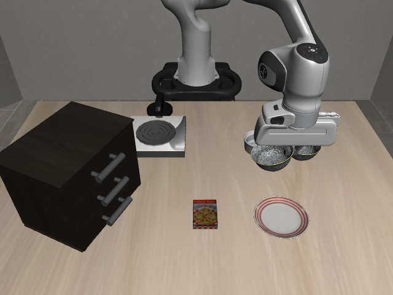
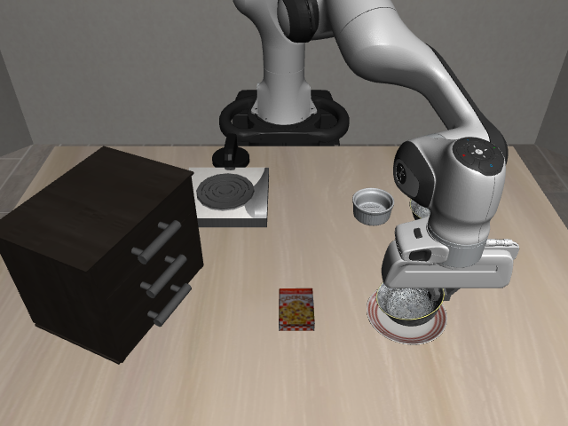

# Attempt 001: grasp and transport succeeded; release was not executed

This first controlled physical attempt stopped in **PLACE at step 1,778**.
The abort message was `Environment terminated before state machine completed`.
Inspection afterwards showed a control-flow error, not a physical grasp failure:
LIBERO's `BDDLBaseDomain.step()` assigns returned `done = self._check_success()`.
The bowl had just contacted the plate and satisfied the task predicate while
still grasped. The underlying simulator was not terminating.

The implementation now continues RELEASE/RETRACT on this success signal while
still stopping on an actual underlying simulator termination. A regression test
covers the distinction. Physical parameters and human timings were unchanged for
the verification runs. [Attempt 002](../libero_pick_place_attempt_002/README.md)
was interrupted before grasp; [attempt 003](../libero_pick_place_attempt_003/README.md)
completed the full release/retract sequence successfully.

| Evaluation | Observed result |
|---|---|
| Acquired object | Yes; both finger pads contacted the rim throughout the grasp confirmation window |
| Lifted off support | Yes; origin rose 65.74 mm by end of LIFT, with no remaining bowl/table contact |
| Retained during transport | Yes; no grasp-loss abort; bilateral grip at transport completion |
| Reached target region | Yes |
| Remained after release | Not evaluated; RELEASE was not reached |
| LIBERO success | True at final step, while still held |
| Full manipulation sequence | Incomplete |

Overall EEF RMSE: 1.948 mm. Maximum EEF error: 15.758 mm.
Maximum object lift: 128.709 mm. Final object-to-frozen-target-anchor distance:
15.030 mm. No grasp was lost.

At GRASP_SETTLE, the bowl remained on the table. At LIFT and TRANSPORT completion,
its only logged contacts were with the fingers. At the final PLACE step, the
contacts included both finger pads and `akita_black_bowl_1_g39` against
`plate_1_g1`. Object position was `[0.075533, 0.223443, 0.912326]` m. The bowl was
still physically held when the controller stopped; post-release stability must
not be inferred from this run.

[Metrics](metrics.json) · [Every simulation step](replay.csv) ·
[3D trajectories](manipulation_3d.png) · [Object coordinates](object_timeseries.png) ·
[Tracking error](eef_tracking_error.png) · [Distance to target](object_target_distance.png) ·
[Gripper commands and states](gripper_timeseries.png)
