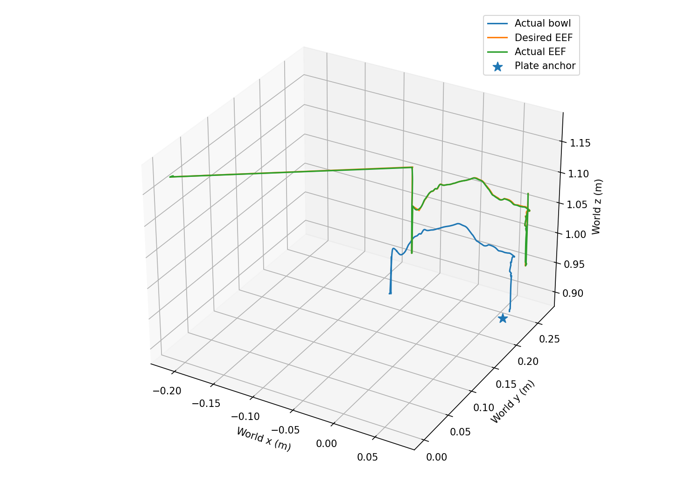
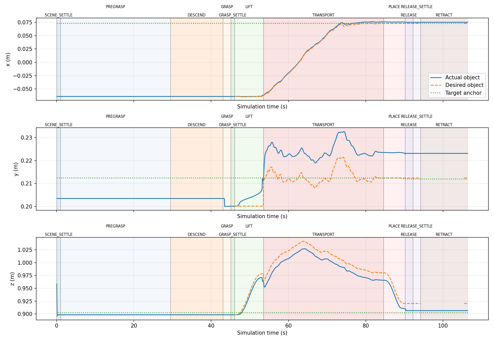
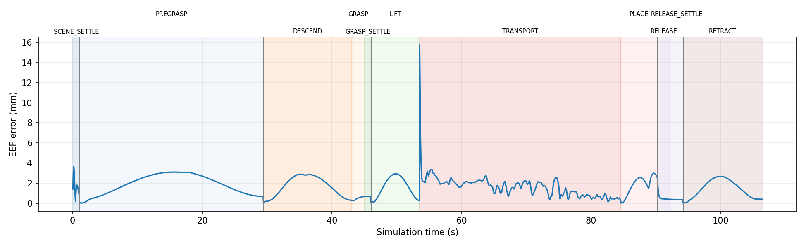
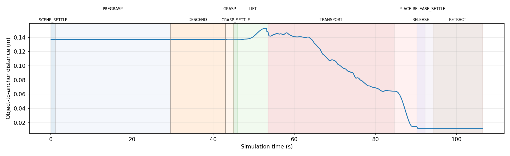
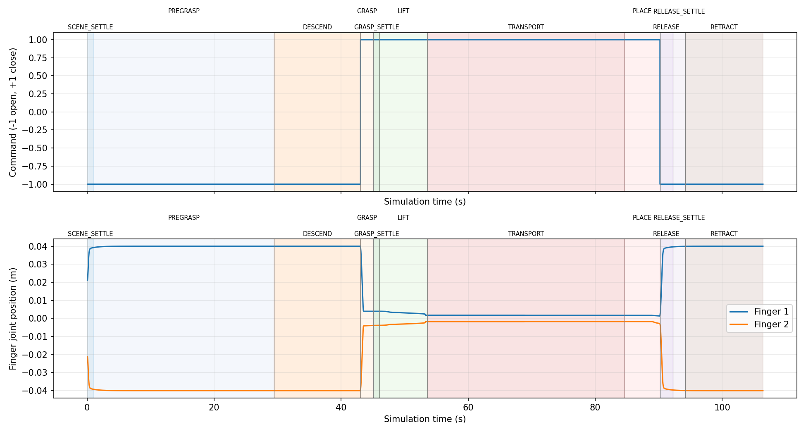
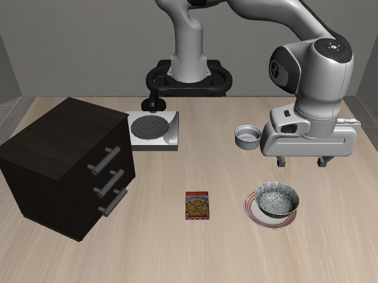

# Scripted pick-and-place verification: attempt 003

Task: LIBERO Spatial 0, black bowl between plate and ramekin -> plate; seed 0.
Completed sequence: **True**. Full post-release task result:
**True**. Total: 2128 control steps
(106.40 simulated seconds).

## Evaluation

| Question | Result |
|---|---|
| Gripper acquired object | True |
| Object lifted off support | True |
| Object stayed grasped through transport | True |
| Object reached target region | True |
| Object remained at target after release | True |
| Final LIBERO task success | True |

| Metric | Value |
|---|---:|
| EEF RMSE | 1.894 mm |
| Maximum EEF tracking error | 15.758 mm |
| Final object-to-initial-target-anchor distance | 11.650 mm |
| Final object-to-physical-placement-origin distance | 17.713 mm |
| Maximum object lift | 128.709 mm |
| Grasp lost | False |
| Failure phase | None |
| Failure reason | None |

LIFT completed at step 1070; bilateral contact True; non-gripper bowl contacts: [].

TRANSPORT completed at step 1691; bilateral contact True; non-gripper bowl contacts: [].

The final post-release check uses the last 20
RETRACT hold samples. The geometric region is within 40 mm in XY and 20 mm of
the configured object-origin placement height. Task completion also requires
LIBERO success and no bilateral grasp throughout that final hold. Anchor-distance
error includes the necessary height difference between bowl and plate body origins;
the physical-placement-origin error is reported separately.

Configured nominal EEF-minus-object grasp offset: [0.0, 0.045, 0.035] m.
Measured/frozen grasp offset: [0.00046106455874907193, 0.048126710890206925, 0.03550926232572682] m.
Actual post-lift object position anchors the unchanged human retargeting transform.
The source interval is 4.336667–10.306667 s, 180 samples; robot phase durations are
independent of human event timestamps. Placement object origin is plate anchor
plus 18 mm in world Z. Transport finishes 60 mm above that placement origin,
then PLACE lowers vertically.

## Controlled-run history

[Attempt 001](../libero_pick_place_attempt_001/README.md) acquired, lifted, and
transported the bowl, but stopped in PLACE when LIBERO's task-success `done`
signal was incorrectly treated as a simulator termination. No physical grasp
failure occurred. The success-signal interpretation was corrected and tested.
[Attempt 002](../libero_pick_place_attempt_002/README.md) was interrupted by SIGTERM
before grasp; it provides no grasp/release outcome. This run adds durable per-step
logging and a graceful SIGTERM diagnostic handler. **All robot parameters and
mapping settings are identical to attempt 001**; there was no physical tuning loop.

Validation: 30 relevant unit tests passed. Independent CSV/JSONL audit verified
step counts, per-phase budgets, gripper commands, action/workspace bounds,
recomputed tracking RMSE, phase contact evidence, and unchanged robot settings.

Source calibration/height flags remain unresolved. A single seed/task test does
not establish grasp robustness across layouts or a general manipulation policy.
There is no policy learning, VLA, behavioral cloning, RL, or world model.

## Diagnostics

[Metrics](metrics.json) · [CSV log](replay.csv) · [Durable per-step log](steps.jsonl) ·
[Executed implementation snapshot](implementation.py) · [State machine documentation](../../docs/LIBERO_PICK_PLACE.md)

