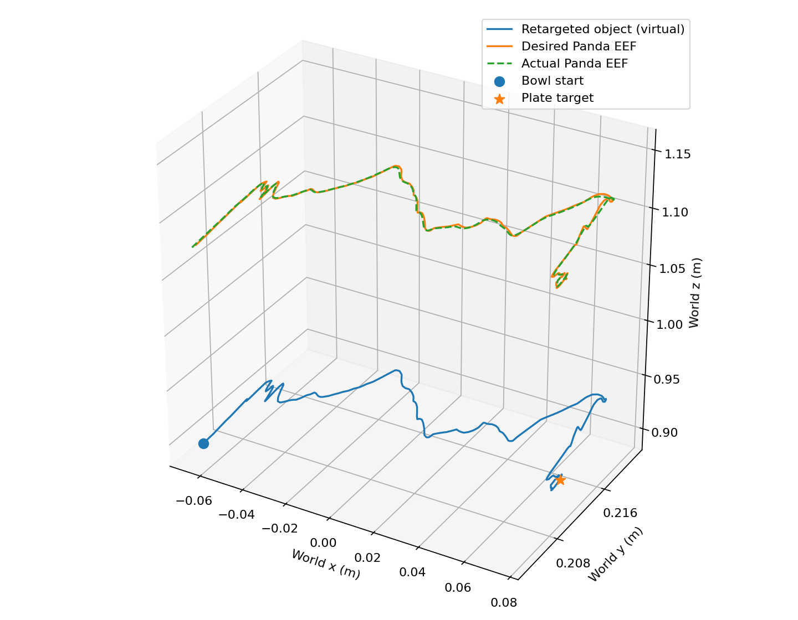
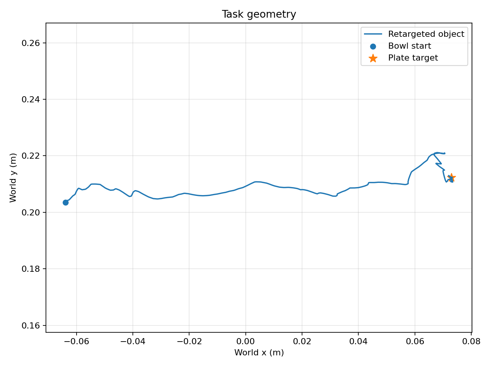
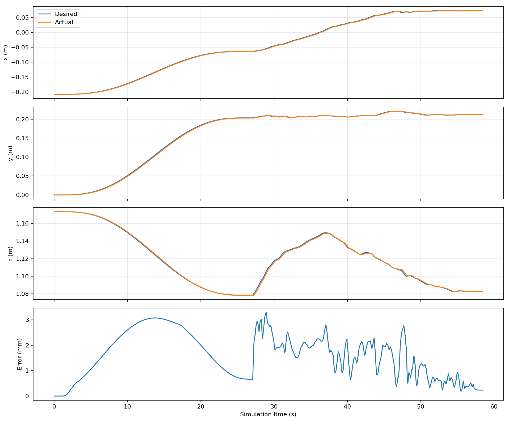
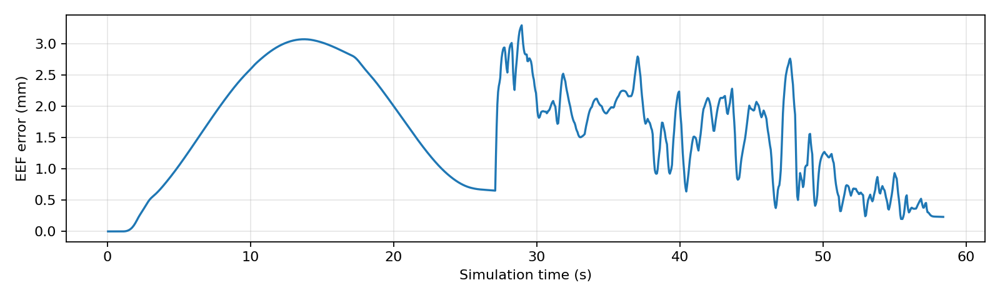

# LIBERO object retargeting: reviewed transport interval

Seed 0, LIBERO Spatial task 0 (black bowl between plate and ramekin -> plate).
Completed all 1168 steps (58.40 s at 20 Hz) without detected
robot/scene contact or workspace exit. The gripper remained open; orientation
was fixed. No grasping or object manipulation was performed.

This run supersedes the original truncated-interval result. The input now contains
180 transport samples from **4.336667 through 10.306667 s**, including carrying,
lowering, and the final hold. Release is annotated at 10.508333 s. See the
[video review and detector diagnosis](../test_007_block_only_raw/task_demo/phase_review.md).
The source metadata retains the automatic estimates and explicit manual provenance.

EEF offset: [0, 0, 0.18] m. Reference speed bound: 0.02 m/s. Transport time stretch:
5.0685x. Controller conversion, mapping, and safety bounds are unchanged.

| Tracking metric | Complete run | Transport only |
|---|---:|---:|
| Mean error | 1.605 mm | 1.533 mm |
| RMSE | 1.837 mm | 1.708 mm |
| Maximum error | 3.297 mm | 3.297 mm |
| Final error | 0.232 mm | 0.293 mm |

Complete-run final error includes the final one-second hold.

| Retargeting metric | Value |
|---|---:|
| Start error | 0.0000 mm |
| Goal error | 0.0000 mm |
| Human start-to-goal distance | 207.2798 mm |
| LIBERO start-to-goal distance | 137.1304 mm |
| Longitudinal horizontal scale | 0.6747  |
| Lateral scale | 1.0000  |
| Vertical scale | 1.0000  |
| Maximum lift above bowl start | 70.9525 mm |
| Path length | 247.6654 mm |
| Smooth endpoint correction norm | 55.1738 mm |

Human longitudinal endpoint progress is now 95.0%
(previously 50.8%). Smooth endpoint correction decreased from 86.982 mm to
55.174 mm. Maximum retargeted lift increased from
13.260 mm to 70.952 mm because the earlier lift and the complete
carry are included. Both virtual object endpoints match their simulated anchors.

The measured human endpoint is still 56.632 mm
from the human goal centre, so correction remains necessary. A goal region is not
an exact point. The source height/calibration flags remain unresolved; results
demonstrate geometry and tracking, not calibrated physical equivalence.

Validation: 10 task-demo tests and 12 controller/retargeting tests passed. The
per-step CSV audit verified annotation provenance, step count, open gripper,
action bounds, reference-speed bound, actual workspace, and recomputed RMSE.

This run used the repaired installation at `/home/student/robot_challenge/LIBERO`,
commit `8f1084e3132a39270c3a13ebe37270a43ece2a01`, without temporary path overrides.
See [mapping and run instructions](../../docs/LIBERO_RETARGETING.md).

## Plots

Machine-readable artifacts: [metrics](metrics.json), [per-step log](replay.csv),
[full reference trajectory](retargeted_trajectory.csv).
