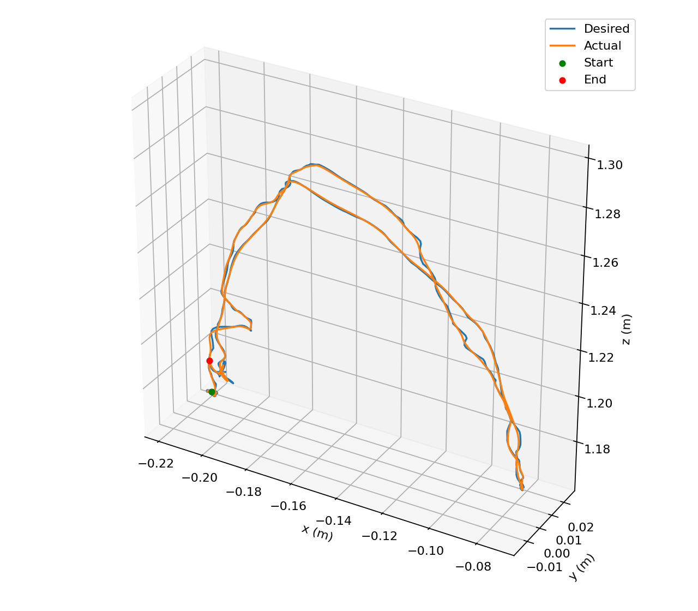
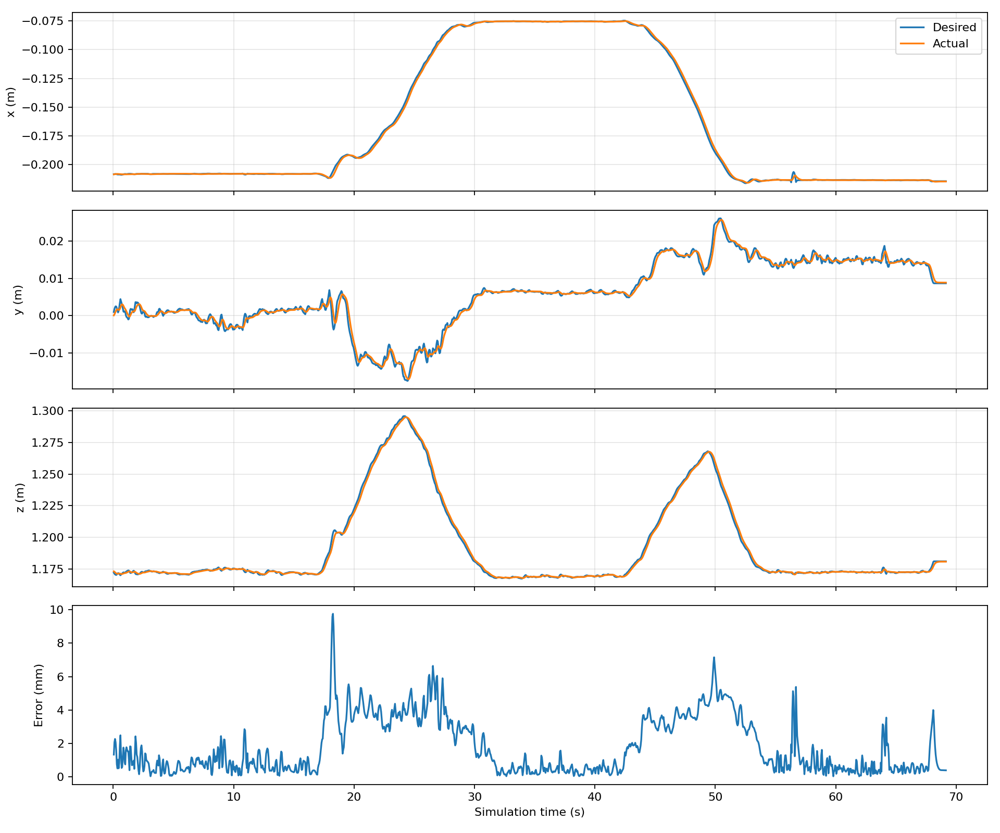

# Measured object motion → Panda: first experiment

The Panda completed the selected continuous measured path with millimetre-scale
Cartesian tracking error, using a uniform 0.5 spatial scale and 2× time stretch.
This supports task-space following for this path and speed; it does not establish
full-size/full-speed tracking or calibrated real-world alignment.

| Metric | Result |
|---|---:|
| Mean Euclidean error | 1.781 mm |
| Cartesian RMSE | 2.429 mm |
| Maximum error | 9.761 mm |
| Final-position error after 1 s hold | 0.400 mm |
| Maximum orientation deviation | 0.335 degrees |
| Control steps | 1383 |
| Simulation duration, including final hold | 69.15 s |
| Clipped steps | 0 |

Same `libero_spatial` task 0 and Panda as `experiments/explore_libero.py`, seed 0.
Reset EEF position: `[-0.2084646605658239, 0.0, 1.1732794757296405]` metres. Initial orientation is held via
closed-loop rotation correction; the gripper command is -1 on every step.
No robot/scene contact was detected at control-step checks. Images are disabled
for runtime efficiency; the scene and physics are retained.

Source: test_006 `cube_center/gap_filled_10_frames/gentle_smoothing/savgol_7.csv`.
The source has 18 unresolved missing samples. This test replays the first 1,022
samples (0–34.058333 s), with identity axis permutation and positive signs.
It completes that segment, but **does not replay the full 42.13-second recording**.
`completed_full_source=false` records this distinction. The selected path contains
two substantial vertical excursions and horizontal transport. No hand pose is used.

Metrics include the final one-second hold and exclude reset. Errors compare each
post-step observation with the target used for that action. RMSE is
sqrt(mean(||desired - actual||²)), in metres before conversion to millimetres.
All seven actions, pre-step command errors and post-step tracking errors are in
[replay.csv](replay.csv). The independently recomputed CSV metrics match JSON;
all actions are within configured limits and all timestamps are spaced by 0.05 s.

## Reproduction

The installed LIBERO task file and some source files contained only zero bytes.
This run used a clean upstream copy at commit
`8f1084e3132a39270c3a13ebe37270a43ece2a01` in `/tmp/libero-trajectory-runtime`,
with its own `/tmp/libero-trajectory-config/config.yaml`, leaving the installed
copy untouched. Exact command, package versions and source hash are in
[runtime.json](runtime.json). Temporary files may not persist across reboots;
use a working LIBERO installation or recreate the checkout at that commit and
point LIBERO's configuration to its BDDL files/assets.

Seven focused transport tests pass. The broader suite passed 39 of 40 tests;
one existing detector test could not run because the LIBERO environment lacks
`pupil_apriltags`. See [implementation and conventions](../../docs/LIBERO_TRAJECTORY.md).
