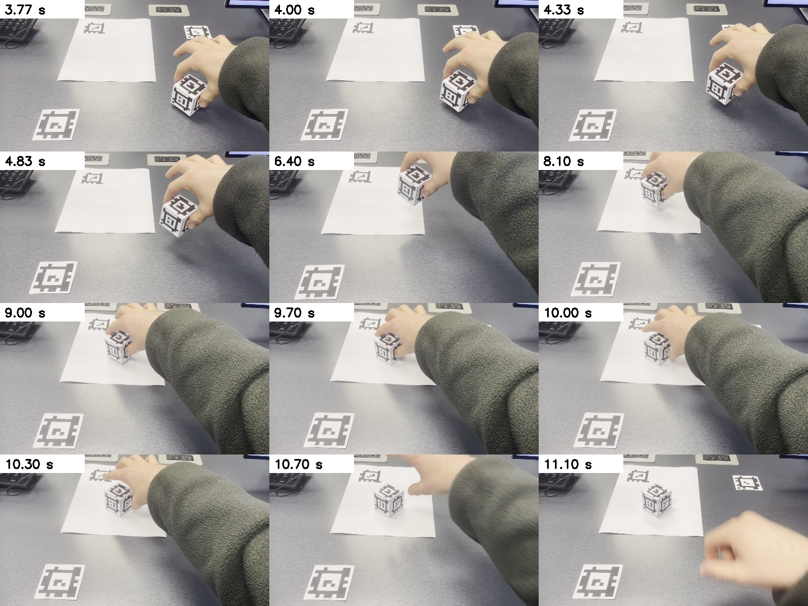
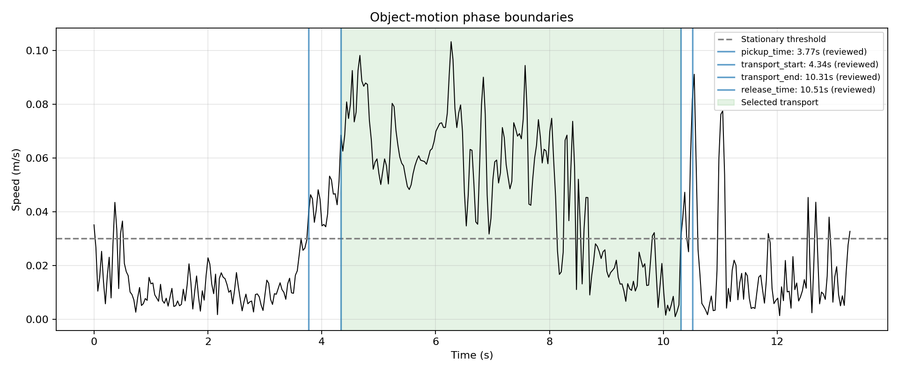

# Video-reviewed transport interval

The automatic segmentation truncated this demonstration. The reviewed interval
is 4.336667–10.306667 s, containing 180 processed source samples and 5.970 s of
carrying, lowering, and the final hold. These are manual semantic annotations,
not an automatic grasp/contact detection result.

| Boundary | Automatic estimate | Requested video annotation | Effective source timestamp |
|---|---:|---:|---:|
| Pickup | 3.770000 s | unchanged | 3.770000 s |
| Transport start | 4.836667 s | 4.33 s | 4.336667 s |
| Transport end | 6.405000 s | 10.30 s | 10.306667 s |
| Release | 8.106667 s | 10.50 s | 10.508333 s |

## Evidence and cause

At 4.33 s the object is already being lifted/carried. At 6.40 s it is still held
in midair, and at 8.10 s carrying/lowering continues. Around 9–10.3 s the hand
holds the object near its destination; it opens/withdraws around 10.3–10.7 s.
The reviewed transport end follows the user's intended action boundary at 10.3 s.
Release is annotated approximately at 10.5 s, within that opening interval.

The automatic routine uses the last above-threshold lift sample in an early
window for transport start, and the first above-threshold downward sample in the
latter half of detected motion for transport end. Those rules produced 4.837 s
and 6.405 s, respectively. The 0.03 m/s movement threshold then missed much of
the slow final descent/hold, setting release to 8.107 s. Speed alone cannot tell
whether a stationary object is still being held.

The fix uses explicit per-demo video annotations in
[config/test_007_demo.json](../../../config/test_007_demo.json). The generic
heuristic remains an estimate rather than being tuned to force these timestamps
for unrelated recordings. Approximate annotations now snap to source timestamps,
so phase CSVs, metadata, progress endpoints, and the LIBERO loader agree exactly.
Original automatic values and diagnostics remain separately identifiable in
metadata. Release was moved as well to preserve the required chronological order.

Raw tracking, trajectory smoothing, goal geometry, and calibration were unchanged.
Human transport path length changed from 102.106 mm to 302.439 mm because the
complete reviewed interval is now included. Height/calibration limitations in the
source metadata remain unresolved.

